# Route map

Generated by `go run ./tools/routemap`. Do not edit by hand — re-run it instead, so the diagram cannot drift from `main.go`.

## Every route

| Route | Auth | Rate limit | Handler | Store methods |
|---|---|---|---|---|
| `POST /api/auth/login` | public | 10 / 5*time.Minute | `api.Login` | `CreateSession`, `UserByEmail` |
| `POST /api/auth/logout` | public | — | `api.Logout` | `DeleteSession` |
| `POST /api/auth/register` | public | 5 / 10*time.Minute | `api.Register` | `CreateSession`, `CreateUser` |
| `GET /api/rooms/{roomID}/join` | public | — | `api.JoinRoom` | `RoomByInvite` |
| `POST /api/run` | public | 30 / time.Minute | `api.Run` | — |
| `GET /healthz` | public | — | `inline func` | — |
| `GET /ws/{roomID}` | public | — | `ws.Handler` | — |
| `GET /api/me` | bearer | — | `api.Me` | `CountRooms`, `UsedDuration` |
| `POST /api/promo/redeem` | bearer | — | `api.RedeemPromo` | `CountRooms`, `RedeemPromoCode`, `UsedDuration`, `UserByID` |
| `POST /api/rooms` | bearer | — | `api.CreateRoom` | `CreateRoom`, `CreateRoomWithinPlan` |
| `GET /api/rooms` | bearer | — | `api.ListRooms` | `RoomsByOwner` |
| `GET /api/rooms/{roomID}` | bearer | — | `api.GetRoom` | `RoomByID` |
| `DELETE /api/rooms/{roomID}` | bearer | — | `api.CloseRoom` | `CloseRoom` |
| `POST /api/rooms/{roomID}/invite` | bearer | — | `api.RotateInvite` | `RoomByID`, `RotateInvite` |
| `PUT /api/rooms/{roomID}/prompt` | bearer | — | `api.UpdatePrompt` | `UpdatePrompt` |
| `GET /api/admin/promo` | owner | — | `api.ListPromoCodes` | `PromoCodes` |
| `POST /api/admin/promo` | owner | — | `api.CreatePromoCode` | `CreatePromoCode` |
| `DELETE /api/admin/promo/{code}` | owner | — | `api.DeletePromoCode` | `ClearPromoGrants`, `DeletePromoCode` |
| `GET /api/admin/users` | owner | — | `api.ListUsers` | `Users` |
| `PATCH /api/admin/users/{userID}` | owner | — | `api.SetUserPlan` | `SetUserPlan` |

## Routes by authorization tier

```mermaid
flowchart LR
  subgraph public["Public - no token"]
    direction LR
    rPOST_api_auth_login["POST /api/auth/login"]
    rPOST_api_auth_logout["POST /api/auth/logout"]
    rPOST_api_auth_register["POST /api/auth/register"]
    rGET_api_rooms__roomID__join["GET /api/rooms/#123;roomID#125;/join"]
    rPOST_api_run["POST /api/run"]
    rGET_healthz["GET /healthz"]
    rGET_ws__roomID_["GET /ws/#123;roomID#125;"]
  end
  subgraph bearer["RequireAuth - session token"]
    direction LR
    rGET_api_me["GET /api/me"]
    rPOST_api_promo_redeem["POST /api/promo/redeem"]
    rPOST_api_rooms["POST /api/rooms"]
    rGET_api_rooms["GET /api/rooms"]
    rGET_api_rooms__roomID_["GET /api/rooms/#123;roomID#125;"]
    rDELETE_api_rooms__roomID_["DELETE /api/rooms/#123;roomID#125;"]
    rPOST_api_rooms__roomID__invite["POST /api/rooms/#123;roomID#125;/invite"]
    rPUT_api_rooms__roomID__prompt["PUT /api/rooms/#123;roomID#125;/prompt"]
  end
  subgraph owner["RequireAdmin - owner only"]
    direction LR
    rGET_api_admin_promo["GET /api/admin/promo"]
    rPOST_api_admin_promo["POST /api/admin/promo"]
    rDELETE_api_admin_promo__code_["DELETE /api/admin/promo/#123;code#125;"]
    rGET_api_admin_users["GET /api/admin/users"]
    rPATCH_api_admin_users__userID_["PATCH /api/admin/users/#123;userID#125;"]
  end
  hapi_Login("api.Login")
  rPOST_api_auth_login --> hapi_Login
  hapi_Logout("api.Logout")
  rPOST_api_auth_logout --> hapi_Logout
  hapi_Register("api.Register")
  rPOST_api_auth_register --> hapi_Register
  hapi_JoinRoom("api.JoinRoom")
  rGET_api_rooms__roomID__join --> hapi_JoinRoom
  hapi_Run("api.Run")
  rPOST_api_run --> hapi_Run
  hinline_func("inline func")
  rGET_healthz --> hinline_func
  hws_Handler("ws.Handler")
  rGET_ws__roomID_ --> hws_Handler
  hapi_Me("api.Me")
  rGET_api_me --> hapi_Me
  hapi_RedeemPromo("api.RedeemPromo")
  rPOST_api_promo_redeem --> hapi_RedeemPromo
  hapi_CreateRoom("api.CreateRoom")
  rPOST_api_rooms --> hapi_CreateRoom
  hapi_ListRooms("api.ListRooms")
  rGET_api_rooms --> hapi_ListRooms
  hapi_GetRoom("api.GetRoom")
  rGET_api_rooms__roomID_ --> hapi_GetRoom
  hapi_CloseRoom("api.CloseRoom")
  rDELETE_api_rooms__roomID_ --> hapi_CloseRoom
  hapi_RotateInvite("api.RotateInvite")
  rPOST_api_rooms__roomID__invite --> hapi_RotateInvite
  hapi_UpdatePrompt("api.UpdatePrompt")
  rPUT_api_rooms__roomID__prompt --> hapi_UpdatePrompt
  hapi_ListPromoCodes("api.ListPromoCodes")
  rGET_api_admin_promo --> hapi_ListPromoCodes
  hapi_CreatePromoCode("api.CreatePromoCode")
  rPOST_api_admin_promo --> hapi_CreatePromoCode
  hapi_DeletePromoCode("api.DeletePromoCode")
  rDELETE_api_admin_promo__code_ --> hapi_DeletePromoCode
  hapi_ListUsers("api.ListUsers")
  rGET_api_admin_users --> hapi_ListUsers
  hapi_SetUserPlan("api.SetUserPlan")
  rPATCH_api_admin_users__userID_ --> hapi_SetUserPlan
```

## Handlers to store methods

Which part of the database each handler can reach. A handler touching more of the store than you expected is worth a second look.

```mermaid
flowchart LR
  hapi_Login("api.Login")
  sCreateSession[("CreateSession")]
  hapi_Login --> sCreateSession
  sUserByEmail[("UserByEmail")]
  hapi_Login --> sUserByEmail
  hapi_Logout("api.Logout")
  sDeleteSession[("DeleteSession")]
  hapi_Logout --> sDeleteSession
  hapi_Register("api.Register")
  hapi_Register --> sCreateSession
  sCreateUser[("CreateUser")]
  hapi_Register --> sCreateUser
  hapi_JoinRoom("api.JoinRoom")
  sRoomByInvite[("RoomByInvite")]
  hapi_JoinRoom --> sRoomByInvite
  hapi_Me("api.Me")
  sCountRooms[("CountRooms")]
  hapi_Me --> sCountRooms
  sUsedDuration[("UsedDuration")]
  hapi_Me --> sUsedDuration
  hapi_RedeemPromo("api.RedeemPromo")
  hapi_RedeemPromo --> sCountRooms
  sRedeemPromoCode[("RedeemPromoCode")]
  hapi_RedeemPromo --> sRedeemPromoCode
  hapi_RedeemPromo --> sUsedDuration
  sUserByID[("UserByID")]
  hapi_RedeemPromo --> sUserByID
  hapi_CreateRoom("api.CreateRoom")
  sCreateRoom[("CreateRoom")]
  hapi_CreateRoom --> sCreateRoom
  sCreateRoomWithinPlan[("CreateRoomWithinPlan")]
  hapi_CreateRoom --> sCreateRoomWithinPlan
  hapi_ListRooms("api.ListRooms")
  sRoomsByOwner[("RoomsByOwner")]
  hapi_ListRooms --> sRoomsByOwner
  hapi_GetRoom("api.GetRoom")
  sRoomByID[("RoomByID")]
  hapi_GetRoom --> sRoomByID
  hapi_CloseRoom("api.CloseRoom")
  sCloseRoom[("CloseRoom")]
  hapi_CloseRoom --> sCloseRoom
  hapi_RotateInvite("api.RotateInvite")
  hapi_RotateInvite --> sRoomByID
  sRotateInvite[("RotateInvite")]
  hapi_RotateInvite --> sRotateInvite
  hapi_UpdatePrompt("api.UpdatePrompt")
  sUpdatePrompt[("UpdatePrompt")]
  hapi_UpdatePrompt --> sUpdatePrompt
  hapi_ListPromoCodes("api.ListPromoCodes")
  sPromoCodes[("PromoCodes")]
  hapi_ListPromoCodes --> sPromoCodes
  hapi_CreatePromoCode("api.CreatePromoCode")
  sCreatePromoCode[("CreatePromoCode")]
  hapi_CreatePromoCode --> sCreatePromoCode
  hapi_DeletePromoCode("api.DeletePromoCode")
  sClearPromoGrants[("ClearPromoGrants")]
  hapi_DeletePromoCode --> sClearPromoGrants
  sDeletePromoCode[("DeletePromoCode")]
  hapi_DeletePromoCode --> sDeletePromoCode
  hapi_ListUsers("api.ListUsers")
  sUsers[("Users")]
  hapi_ListUsers --> sUsers
  hapi_SetUserPlan("api.SetUserPlan")
  sSetUserPlan[("SetUserPlan")]
  hapi_SetUserPlan --> sSetUserPlan
```

